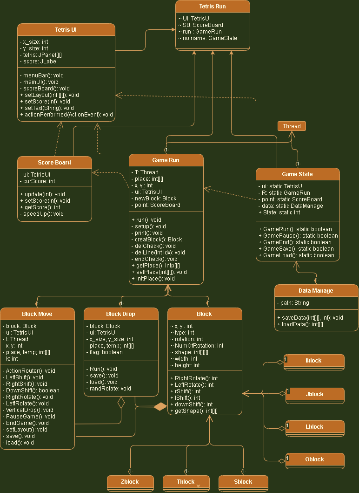

# Tetris
## UML

 
 

# TetrisRun
TetrisRun 클래스는 테트리스를 진행하는데 있어 모든 클래스를 집합해 둔 클래스 이다.     
UI를 생성하고, 점수판과 게임 진행 객체, 게임의 상태를 생성한다.  

---

 
 
 

# TetrisUI
테트리스의 전체 UI를 구성한다.    

테트리스는 가로 10칸, 세로 22칸으로 구성하기 위해 JPnael을 2차원 배열로 구성한다.     

또한 점수를 표시하기 위한 보드를 만들어 JLabel의 텍스트로 점수를 갱신한다.     
 
메뉴바는 게임 관련 메소드를 제공한다.    
게임이 종료되었을 경우 새 게임을 진행하는 것, 게임 저장 및 불러오기, 게임 종료 또는 프로그램 종료를 제공한다.

## 제공 메소드
- setLayout(intp[][])
    - 테트리스 게임 Layout을 갱신한다.
- setScore(int)
    - 테트리스 게임을 진행할 경우 점수판의 점수를 갱신한다.
- setText(String)
    - 게임 진행 중이 아닐 경우 현재 상태에서 제공하는 메시지를 표시한다.
---

 
 
 

# ScoreBoard
현재 실행되고 있는 프로그램의 점수를 저장하는 객체이다.     
점수의 갱신이 필요한 경우 현재 점수를 갱신하고, 해당 점수에 맞는 블럭의 스피드를 조절한다.

## 제공 메소드
- update(int)
    - 새로 얻은 점수를 갱신하기 위한 메소드이다.
    - 게임 진행 중인 상태에 사용한다.
- setScore(int)
    - 입력받은 점수로 초기화한다.
    - 저장된 게임을 불러올 경우 저장된 게임의 점수를 불러와 초기화한다.
- getScore()
    - 현재 점수를 리턴한다.
---
 
 
 

# GameState
프로그램의 각 상태를 4가지로 구분하여 그 상태를 저장하고 그 상태에 맞는 동작을 수행하는 클래스이다.    
그 4가지는
- Initial Set State
- Run State
- Pause State
- End State

로 구분된다.     
State의 변수로 전체 상태를 구분하며, 각 상태에 따라 제공 메소드의 동작을 통해 제어한다.

## 제공 메소드
- GameRun()
    - 게임을 진행하는 메소드이다.
    - 현 상태가 초기상태일 경우 그대로 진행한다.
    - 현 상태가 게임이 종료가 된 상태일 경우 점수보드와 현 테트리스 게임창 및 게임 데이터를 초기화 한 후 게임을 진행한다.
    - 그 외 상태일 경우(Run, Pause) 무시한다.
- GamePause()
    - 게임 진행하던 도중 일시정지를 수행한다.
    - GameRun 클래스는 쓰레드를 상속받아 동작하므로 쓰레드 사용 일시 중지 메소드인 suspend()를 사용하고 멈춘다.
    - 재개할 경우 resume()메소드를 통해 실행한다.
    - 게임 진행, 게임 일시정지 상태가 아닌 나머지 상태일 경우(Init, End) 새 게임을 진행하기 위해 GameRun()메소드를 호출한다.
- GameEnd()
    - 현 상태를 End상태로 바꾼다.
    - 게임을 더 이상 진행시키지 않는다.
- GameSave()
    - 데이터 관리 객체([DataManage](./#DataManage_class))를 통해 현재 게임 정보를 저장한다.
    - 저장 정보는 게임 진행의 2차원 배열, 현 점수 이다.
    - 저장에 성공했을 경우 true, 실패했을 경우 false를 반환한다.

- GameLoad()
    - 데이터 관리 객체([DataManage](./#DataManage_class))를 통해 저장된 게임 정보를 불러온다.
    - 저장 정보는 게임 진행의 2차원 배열, 현 점수 이다.
        - 2차원 배열의 마지막 칸에 현 점수가 저장되어 있다.
        - 따라서, 이 값을 읽고 점수를 갱신한다.
    - 불러오기에 성공했을 경우 true, 실패했을 경우 false를 반환한다.

## DataManage Class
관계성: (Association)     
게임 데이터의 정보를 저장하고 불러오는 클래스이다.     

저장하고 불러오는 단위는 객체이며, 그 객체는 2차원 배열이다.    
2차원 배열은 테트리스 게임의 쌓인 블럭 정보를 담고 있으며, 그 배열의 끝에 점수를 저장한다.     
(게임 진행에 있어 잉여 공간이다.)

### 제공 메소드
- saveData(int[][], int)
    - 저장 경로 Path는 "C:\\Program Files\\Tetris"이다.
        - 일반적으로 저장할 경우 실패한다.
        - 그 이유는 Program Files에서 새로운 파일을 만들기에 권한이 없기 때문이다.
        - 따라서 IDE를 실행할 때 관리자 권한으로 실행한다.
    - Tetris 폴더가 없을 경우 폴더를 생성하고, Tetris.dat 파일이 없을 경우 파일을 생성하여 저장한다.
    - 저장에 성공할 경우 true, 실패할 경우 false를 반환한다.
- loadData()
    - 경로 "C:\\Program Files\\Tetris"에서 Tetris.dat 파일을 읽어온다.
    - 불러온 객체는 2차원 배열로 강제형변환을 해주어 그 값을 반환한다.
---
 
 
 

# GameRun
게임 진행의 메인 클래스이다.    
쓰레드를 상속받아 쓰레드에 올려 게임을 진행한다.    

게임 진행 상태 State가 2가 입력 될 경우 BlockDrop이 실행 된다. 그 후 생성된 블럭이 떨어지며 게임이 진행된다.

떨어지는 블럭을 조정하는 BlockMove를 통해 해당 블럭을 조정한다.    

BlcokDrop 이 끝날 경우 테트리스 게임 Layout을 탐색하여 완성된 줄을 탐색한다. 탐색 후 그 라인을 삭제하고 UI를 갱신한다.     
또한 게임이 끝났는지를 체크하여 게임 종료 유무를 판단한다.

## 제공 메소드
- run(): 테트리스 게임을 진행한다.
- getPlace()
    - 테트리스 게임의 진행 정보인 2차원 배열을 제공한다.
    - 게임의 쌓여진 현 상태를 반환
- setPlace(int[][])
    - 테트리스 전체 Layout을 입력받은 배열로 갱신한다.
- initPlace()
    - 이전 상태가 무엇이었든 초기 상태로 돌린다.
    - 즉, 어떠한 블럭을 다 없애고 초기화 한다.

## BlockDrop
블럭이 떨어지는 원리는 다음과 같다.
1. 현재 저장된 배경 Layout 데이터를 temp 배열에 저장한다.
2. 블럭을 Layout을 이루는 place에 저장한다.
3. 현재 블럭이 가지는 좌표에서 1증가된 y좌표가 layout에서 장애물이 있는지 판단한다.
    - 혹여 장애가 있어 내려갈 수 없는 상태일 경우 현재 블럭 데이터를 layout에 표현하고 이 동작을 종료한다.
    - 장애가 없을경우 다음을 수행한다.
4. 생성된 블럭의 y좌표를 1씩 증가한다.
5. 새로 갱신된 place를 UI로 표현한다.
6. place에 temp에 저장된 초기 배경을 저장하고 2번부터 이 동작이 끝날 때까지 수행한다.

블럭의 회전이 랜덤하게 이루어질 수 있도록 randRotate()를 호출한다.

## BlockMove
생성된 블럭의 동작을 제어한다.    
입력받은 key값을 ActionRouter()를 통해 각각에 맞는 블럭 제어를 한다.     
좌, 우, 하강, 좌회전, 우회전, 수직하강을 통해 블럭제어를 수행한다.
BlockDrop과 같이 해당 동작을 수행하고 layout을 갱신하여 UI에 표시한다.

또한 게임 중 입력받은 키에 따라 게임의 일시정지와 게임 종료를 수행한다.

## Block
각 블럭 모양의 최상위 클래스이자 추상클래스이다.    
각 블럭은 이 클래스를 토대로 생성한다.

shape[a][b][c] 3차원 배열로 모양을 정하는데, a는 해당 모양의 회전한 모양을 의미한다.     
shape[rotation][b][c]를 통해 하나의 블럭을 구성한다.

### 제공 메소드
- RightRotate()
    - 블럭의 오른쪽 회전을 하여 저장 후 리턴한다.
- LeftRotate()
    - 블럭의 왼쪽 회전을 하고 저장 후 리턴한다.
- rShift()
    - x좌표를 증가시킨 후 리턴한다.
- lShift()
    - x좌표를 감소시킨 후 리턴한다.
- downShift()
    - y좌표를 증가시킨 후 리턴한다.
- getShape()
    - 현 블럭의 모양을 반환한다.
